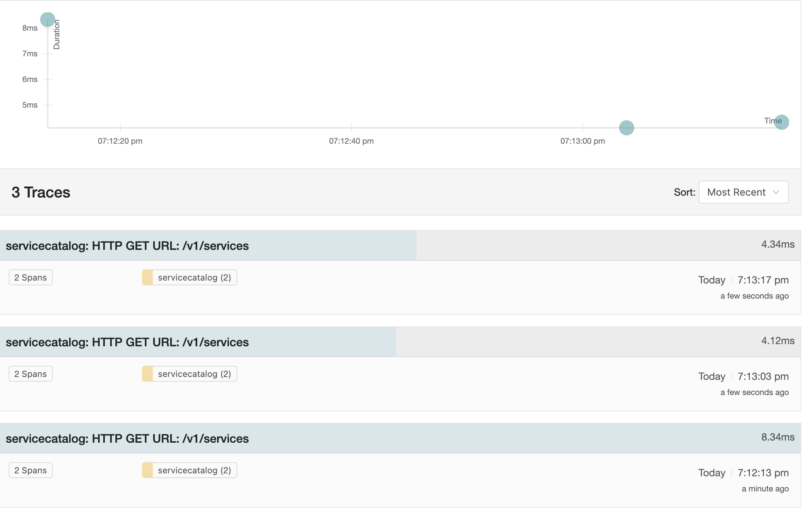
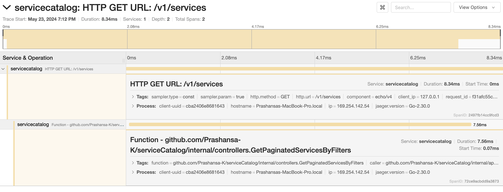

# Working of all Service APIs

### Create Service

## Create Version

## Get All Services - No Filters

## Get All Services - Name Filters

## Get All Services - All Filters

## Get All Services - Pagination

## Get All Services - Sort

## Get Specific Service 

## Get Specific Service - Pagination

## Update Service

## Delete Service

## Delete Version

# Metrics

# Tracing

# Tests

